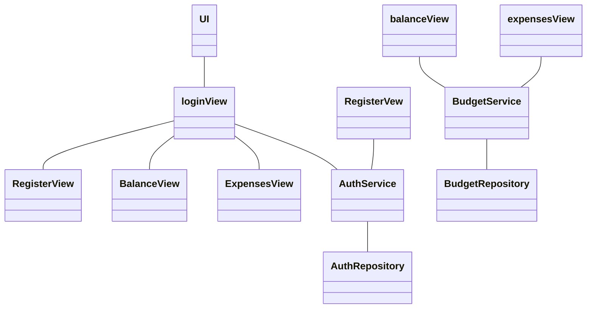

Arkkitehtuurikuvaus (kaaviosta)

Kaavio havainnollistaa sovelluksen kerrosarkkitehtuurin ja komponenttien väliset suhteet.

UI-kerros sisältää näkymät, kuten loginView, RegisterView, balanceView ja expensesView. Käyttöliittymäkomponentit kommunikoivat palveluluokkien kautta sovelluksen logiikan kanssa.

Service-kerros (AuthService, BudgetService) sisältää toimintalogiikan ja toimii rajapintana käyttöliittymän ja tietovarastojen välillä.

Repository-kerros (AuthRepository, BudgetRepository) vastaa tietokantayhteyksistä, tallennuksesta ja tietojen hakemisesta.

Kaavio osoittaa komponenttien keskinäiset riippuvuudet: käyttöliittymäkomponentit käyttävät palveluita, palvelut käyttävät repositoryja, jotka yhdistävät sovelluksen tietokantaan.

