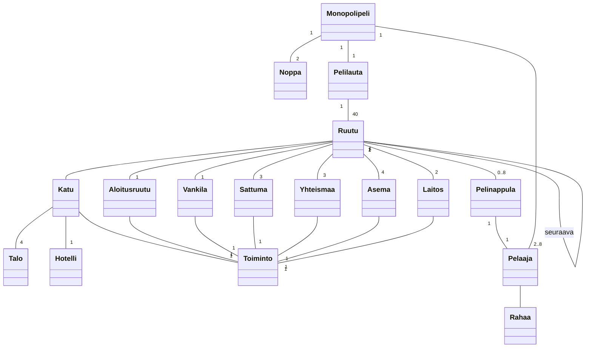

## Monopoli, alustava luokkakaavio

```mermaid
 classDiagram
    Monopolipeli "1" -- "2" Noppa
    Monopolipeli "1" -- "1" Pelilauta
    Pelilauta "1" -- "40" Ruutu
    Ruutu "1" -- "1" Ruutu : seuraava
    Ruutu "1" -- "0..8" Pelinappula
    Ruutu -- "1" Aloitusruutu
    Ruutu -- "1" Vankila
    Ruutu -- "3" Sattuma
    Ruutu -- "3" Yhteismaa
    Ruutu -- Katu
    Ruutu -- "4" Asema
    Ruutu -- "2" Laitos
    Katu -- "4" Talo
    Katu -- "1" Hotelli
    Katu -- "1" Toiminto
    Aloitusruutu -- "1" Toiminto
    Vankila -- "1" Toiminto
    Sattuma -- "1" Toiminto
    Yhteismaa -- "1" Toiminto
    Asema -- "1" Toiminto
    Laitos -- "1" Toiminto
    Pelinappula "1" -- "1" Pelaaja
    Pelaaja "2..8" -- "1" Monopolipeli
    Pelaaja --Rahaa
```
